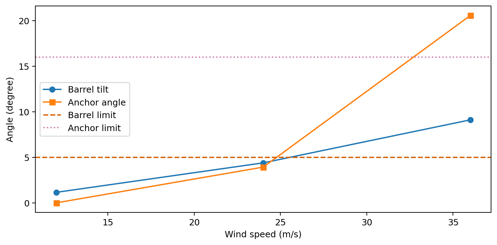
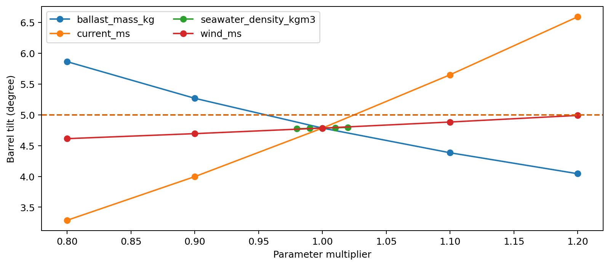

# 2016A 系泊系统的设计

## 摘要

本文把浮标—钢管—钢桶—重物球—锚链系统分解为浮力平衡、水平环境载荷、竖向张力递推和悬链线几何四部分，分别求解锚链接地与全悬浮状态。

悬链线同时使用闭式公式和数值积分计算水平跨度与垂直升高，以绝对误差复核解析实现。对题1给定II型22.05 m锚链、1200 kg重物球和12/24/36 m/s风速计算状态。

面向水深16—20 m、风速36 m/s和流速1.5 m/s的离散场景搜索，得到当前目标函数下的候选：I型、36.0 m、重物球5000 kg；在20 m极端场景中桶倾4.786°、锚端角15.041°。

- 关键词：系泊系统
- 悬链线
- 非线性方程
- 约束审计
- 鲁棒设计

## 1 问题重述与任务分解

题目要求计算不同风速下的钢桶与钢管倾角、锚链形状、浮标吃水和游动范围，并调节重物球使钢桶倾角不超过5°、锚端切线与海床夹角不超过16°。

进一步要在水深16—20 m、流速最高1.5 m/s、风速最高36 m/s下选择锚链型号、长度和重物球质量。设计目标是吃水、游动区域和倾角尽可能小。

本文先复现给定方案，再做极端场景离散搜索。由于题面未给制造成本和安全系数，目标函数中的重量罚项只用于候选排序，不能解释为真实经济成本。

## 2 题面参数与数据字典

浮标简化为直径2 m、高2 m、质量1000 kg的圆柱；4根钢管各长1 m、直径0.05 m、质量10 kg；钢桶长1 m、外径0.30 m、总质量100 kg。

锚链有I—V五型，单位长度质量分别为3.2、7、12.5、19.5和28.12 kg/m。风力和水流力采用题面给出的0.625Sv²与374Sv²。

2016A没有独立附件。材料密度7850 kg/m³与标准重力9.80665 m/s²是本模型公开增加的物理常数/材料假设。

| 对象 | 主要参数 |
|---|---|
| 浮标 | D=2 m, H=2 m, m=1000 kg |
| 钢管 | 4×(L=1 m, D=0.05 m, m=10 kg) |
| 钢桶 | L=1 m, D=0.30 m, m=100 kg |
| 硬约束 | 桶倾≤5°；锚端角≤16°；0<吃水<2 m |

## 3 假设、受力与符号

假设系统处于稳态，风和流同向且水平；忽略波浪、惯性、涡激振动、锚链弯曲刚度和链环局部接触。钢构件浮力按统一钢密度折算。

设H为贯穿柔性锚链和串联构件的水平张力，V0为锚端竖向张力，w为锚链水下单位长度重量，Ls为悬空链长。

钢桶和每根钢管的倾角由该构件中点处水平张力与竖向张力之比计算。浮标吃水由其自身质量、上部支承的构件有效质量、悬链有效质量和V0共同决定。

| 符号 | 含义 | 单位 |
|---|---|---|
| H | 水平张力 | N |
| V0 | 锚端竖向张力 | N |
| w | 锚链水下线重 | N/m |
| Ls | 悬空锚链长度 | m |
| d | 浮标吃水 | m |

## 4 环境载荷与浮力平衡

浮标迎风投影取直径乘露出水面高度；水流投影取浮标浸没部分、四根钢管和钢桶的直径—长度投影。未计锚链流阻，这一假设在高流速下可能低估水平力。

水下钢构件使用有效质量m(1-ρw/ρsteel)。接触海床的链段不由浮标承重；全悬浮状态下锚端竖向张力也传递到浮标。

浮力方程、水平力平衡和垂直几何闭合组成三个非线性方程。采用有界最小二乘求解，最终最大无量纲/米制残差写入审计表。

## 5 解析悬链线模型

对不可伸长、均匀线重的柔性锚链，以弧长s为参数，有水平切向分量H恒定、竖向分量V(s)=V0+ws。

水平跨度为H/w乘两个反双曲正弦之差；垂直升高为两端张力模长之差除以w。锚端角为arctan(V0/H)。

若求得Ls小于总链长且方程闭合，则多余锚链接触海床并有V0=0；否则令Ls等于总长并求V0≥0。该互斥逻辑避免凭经验预设锚链状态。

## 6 数值积分对照模型

独立对dx/ds=H/√(H²+V²)和dy/ds=V/√(H²+V²)做高精度自适应积分，以同一H、V0、w和Ls复算跨度。

解析与数值的x、y绝对误差应接近浮点舍入尺度。该测试能发现反双曲函数符号、端点张力和单位线重实现错误，但不能验证模型假设是否符合真实海况。

三个题面风速状态都保存了对照结果。自动测试进一步要求绝对误差小于10⁻⁸ m。

## 7 题1与题2计算结果

12 m/s时锚链仍有海床接触；24 m/s和36 m/s时本模型进入全悬浮状态。随着风速提高，桶倾、锚端角、吃水和水平游动整体增大。

36 m/s下原1200 kg重物球方案同时越过桶倾与锚端角限制，说明题2必须调整设计。这里的判断来自显式约束审计，而不是视觉判断锚链曲线。

游动区域以水平偏移半径报告；实际平面方向随风流方向变化。若风流不同向，需要二维向量叠加并重新求解。

| 风速 | 状态 | 吃水/m | 桶倾/° | 锚角/° | 游动/m |
|---|---|---|---|---|---|
| 12 | seabed_contact | 0.702 | 1.154 | 0.000 | 8.315 |
| 24 | fully_suspended | 0.716 | 4.392 | 3.927 | 17.745 |
| 36 | fully_suspended | 0.738 | 9.114 | 20.576 | 18.841 |

## 8 原方案误差与约束审计

每个状态检查四类硬条件：钢桶倾角、锚端角、吃水区间、非线性方程最大残差。解析—数值悬链线误差作为独立实现审计。

约束违反数量为零才可称为可行。目标函数更小但违反任一硬约束的方案不会排在可行候选之前。

锚质量600 kg虽为题面参数，但本版未建立锚在海床上的抗拔、摩擦和土体承载模型；16°限制被视作题面给出的代理安全条件。

## 9 多目标离散设计

搜索I—V型锚链、20—36 m偶数长度和1000—5500 kg重物球。每一设计在水深16、18、20 m、风36 m/s、流1.5 m/s三个场景求解。

候选必须在全部场景通过四项硬审计。可行候选按最大游动半径、最大桶倾、重物球质量罚项及链质量—长度罚项的加权和排序。

权重只表达“控制游动和倾角，同时避免无限增重”的工程偏好。不同成本、安全偏好会改变排序，应把Pareto前沿交给设计者而非隐藏在单一分数中。

## 10 鲁棒候选结果

当前权重下排名首位的可行候选为I型锚链、长度36.0 m、重物球5000 kg。

在20 m、36 m/s风、1.5 m/s流的报告场景，吃水1.762 m，桶倾4.786°，锚端角15.041°，游动半径33.802 m。

这只是离散网格与当前静力假设下的候选，不是现实工程定型结论。重物球质量较大，必须进一步检查浮标储备浮力、结构强度、安装能力与失效后果。

| 审计项 | 观测 | 上限 | 通过 |
|---|---|---|---|
| 钢桶倾角 | 4.786 | 5° | 是 |
| 锚端角 | 15.041 | 16° | 是 |
| 吃水 | 1.762 | 2 m | 是 |
| 方程残差 | 1.42e-14 | 1e-6 | 是 |

## 11 敏感性分析

对鲁棒候选分别改变风速、流速、重物球质量和海水密度，其他参数保持不变，观察桶倾、锚端角、吃水和游动半径。

流力与速度平方成正比，因此流速误差会非线性放大。增加重物球通常降低桶倾，却增加吃水和安装负担；目标之间存在真实冲突。

敏感性曲线用于识别关键参数，不能代替联合极端场景。下一步应对风流方向、系数、材料密度和水深做全局采样。

## 12 极限情形与模型校验

当风流趋于零，H应趋小、构件趋近竖直；当链上有海床接触时V0=0、锚端角为0；当链完全悬浮时Ls等于总链长。

吃水必须落在0—2 m内，几何闭合要求链垂升与五个刚性构件的竖向投影之和等于水深减吃水。

这些不变量与数值积分对照构成回归测试。若修改载荷或构件模型后任一测试失败，结果不得进入论文和网页。

## 13 工程适用性与风险

稳态模型忽略波浪循环载荷、疲劳、链环磨损、浮标横摇、海床坡度、锚土耦合和海生物附着；这些因素均可能扩大真实载荷或改变几何。

高达数吨的重物球虽在数学模型中可行，但运输、吊装、连接强度和浮标储备浮力可能使其工程上不可取。模型只负责揭示静力权衡。

建议后续引入安全系数、材料强度、成本和失效概率，开展时域动力仿真与水池/海试标定，并将16°代理约束替换为现场土体参数下的抗拖移模型。

## 14 模型评价与改进方向

模型优点是受力路径透明、两种悬链状态自动切换、解析与数值双重复核、所有硬约束可机器审计。

主要局限是载荷投影简化、未计链流阻、构件倾角用中点张力近似、重物球和钢构件统一材料密度，且多目标权重并非题面给定。

可扩展方向包括二维/三维风流、非均匀链、弹性伸长、动力响应、Pareto优化和不确定性可靠度设计。任何扩展都应保留当前基线作为回归比较。

## 15 结论与复现说明

本文完成题面参数字典、给定方案复算、悬链线双重实现、约束审计、极端场景离散设计和单因素敏感性分析。

复现命令为cumcm-lens run-2016a；Notebook展示公式、状态表、数值积分误差和设计网格。summary.json保留假设、题面参数和全部审计。

报告中的鲁棒候选是数学建模训练结果，不构成真实海上设备设计或安全认证。

- 参数字典：data/dictionaries/2016A.md
- Notebook：notebooks/2016A_mooring.ipynb
- 派生表：data/processed/2016A/
- 自动测试：tests/test_mooring.py
