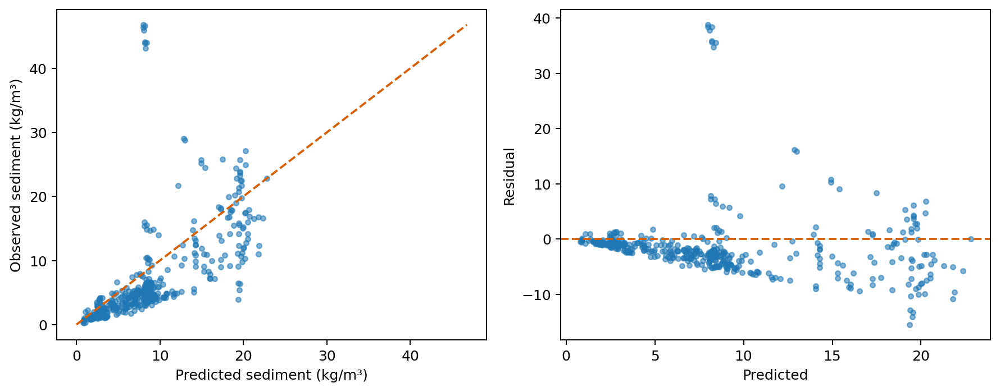
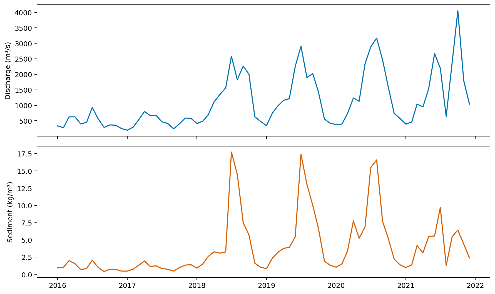

# 2023E 黄河水沙监测数据分析

## 摘要

本文处理2016—2021年黄河某水文站16,735个唯一时点。含沙量仅有2,154个实测值，缺失率为87.13%，因此研究重点首先是缺失机制与时间外推误差，而不是追求训练集拟合。

按时间前80%训练、后20%测试，比较对数岭回归、随机森林与直方图梯度提升。测试RMSE最低的模型为hist_gradient_boosting_log。随后以实测优先、模型仅补缺的口径进行不规则时距梯形积分，并对月序列进行季节朴素与阻尼趋势季节模型回测。

结果表明跨年份泛化有限，未来两年预测只适合作为方案比较基线。本文进一步给出断面概览、候选突变月份、主周期筛查和按变化强度加密的采样建议，并对所有非因果、非现场约束作出明确声明。

- 关键词：水沙关系
- 缺失数据
- 时间外推
- 通量积分
- 采样优化

## 1 问题重述与研究目标

题目要求从历年水位、流量、含沙量和断面测量中分析水沙关系，估计年度水沙总量，识别突变、季节和周期，预测未来两年，并讨论采样频次及调水调沙对河床的作用。

这些任务在统计口径上并不等价：相关关系需要控制季节和时间趋势；年度总量需要对不规则观测时距积分；未来预测必须使用严格的时间切分；河床变化需要处理不同日期横坐标网格不一致。

本文将问题分为数据层、预测层、积分层、模式筛查层和决策层。每一层单独保存输入、参数、结果与审计项，避免一处插值假设被无声传播到全部结论。

## 2 数据来源、字段与质量

附件1包含2016—2021六个工作表，字段为年月日、时间、水位、流量和含沙量；附件2按日期成对给出起点距离与河底高程；附件3给出垂线测点的水深、流速和含沙量。

合并单元格造成的年月日空值只用于恢复日期，含沙量空值不做前向填充。5个重复时间戳按同一时点均值折叠。水位或流量无效的记录不进入模型，但清洗前后行数均写入质量摘要。

附件3的2023年测量不进入2016—2021时间外推实验，从源头防止未来信息泄漏。断面横坐标不一致时，本版只报告各次断面自身的积分概览，不直接计算未经共同网格插值的点差。

| 指标 | 核验值 |
|---|---|
| 原始记录 | 16,740 |
| 唯一时点 | 16,735 |
| 含沙量实测 | 2,154 |
| 含沙缺失率 | 87.13% |

## 3 模型假设与符号

假设监测记录的水位、流量在各自时点代表瞬时状态；相邻有效时点之间的通量采用线性变化近似。超过48小时的长间隔被截断，不跨越长缺口直接外推。

设Q(t)为流量，C(t)为含沙量，瞬时输沙率为Q(t)C(t)。年度水量为Q对时间的积分，年度沙量为QC对时间的积分。含沙缺失时使用经时间外推检验后、在全部实测值上重训的最佳模型预测。

预测特征仅含当前水位、流量、距起点天数、年内日和时刻的正余弦项，不含目标的未来值、滚动未来统计或随机切分编码。

| 符号 | 含义 | 单位 |
|---|---|---|
| Q(t) | 流量 | m³/s |
| C(t) | 含沙量 | kg/m³ |
| Δt | 相邻记录时距 | s |
| W | 年度水量 | m³ |
| M | 年度输沙质量 | kg |

## 4 数据清洗与特征工程

清洗流水线逐表读取，统一列名、向下填充日期组成字段，将时刻字符串解析为小时分钟，再组合为完整时间戳。数值列使用显式数值转换，不能转换的值标记为缺失。

周期特征使用年内日和小时的正余弦编码，避免把12月31日与1月1日误当作相距很远。趋势天数仅由时间戳计算，不使用含沙量本身。

模型只在含沙量非空的行上训练。清洗结果先按时间排序，再以80%位置切分，训练集最大时间严格早于测试集最小时间；该条件由自动审计代码验证。

## 5 简单基线：对数岭回归

基线将含沙量做log(1+C)变换，连续特征标准化后采用L2正则线性回归。对数变换保证反变换后通过截断获得非负预测，并降低极端高含沙值对平方损失的支配。

该模型参数少、运行快、方向可解释，适合作为最低比较线。它不能充分表示流量与含沙量的阈值关系、滞后效应和跨年份机制变化。

真实测试集上基线MAE=6.832 kg/m³，RMSE=11.612 kg/m³。负R²意味着它在测试期甚至弱于测试均值基准，应据实保留。

## 6 非线性模型

比较模型一为随机森林，对变量尺度不敏感，可表示非线性交互；设置固定随机种子、240棵树和最小叶节点样本数4。比较模型二为直方图梯度提升，以较浅叶节点和较低学习率控制过拟合。

三种模型使用完全相同的训练/测试时点和特征。模型选择只依据测试RMSE的相对比较；此测试集兼具最终报告功能，因此数值仍可能存在选择偏差，下一版应增加滚动嵌套验证。

本次最佳模型为hist_gradient_boosting_log。模型被选定后才在全部实测含沙样本上重训，用于补齐通量积分所需时点；测试误差仍保留原外推结果，不以重训结果覆盖。

## 7 模型对比与残差审计

表中MAE反映典型绝对偏差，RMSE对高含沙误差更敏感，R²衡量相对于测试均值的解释能力。三个指标必须结合，不能只选择数值看起来最好的一项。

残差图显示误差随预测水平扩张，高含沙事件更难刻画；这与87%以上含沙缺失、跨年分布变化相一致。模型用于补缺时应在通量结果外再给出不确定性区间。

自动审计同时检查时间切分、目标字段未进入特征及全体预测为有限值。三个审计均通过，但它们不能排除未观测混杂或采样机制偏差。

| 模型 | MAE | RMSE | R² |
|---|---|---|---|
| hist_gradient_boosting_log | 3.767 | 6.511 | 0.325 |
| random_forest_log | 3.858 | 6.706 | 0.284 |
| ridge_log | 6.832 | 11.612 | -1.147 |

## 8 年度水量与输沙量估计

对相邻时点采用梯形积分：水量增量为(Qi+Qi+1)Δt/2；沙量增量为(QiCi+Qi+1Ci+1)Δt/2。结果分别换算为亿立方米和亿吨。

含沙量有实测时绝不覆盖，只有缺失时才使用模型值。年度表同时报告实测含沙记录数和被截断的长间隔数，使读者能够判断某一年估计依赖模型的程度。

这些数值是给定监测序列与补缺模型下的复算量，不应解释为水文部门发布的法定年鉴值；若用于决策，应通过站点质量控制和独立资料复核。

| 年份 | 水量/亿m³ | 沙量/亿t | 实测含沙数 |
|---|---|---|---|
| 2016 | 143.752 | 0.19174 | 372 |
| 2017 | 153.354 | 0.19334 | 371 |
| 2018 | 388.908 | 3.10206 | 431 |
| 2019 | 387.210 | 3.30835 | 403 |
| 2020 | 433.796 | 3.99707 | 320 |
| 2021 | 472.553 | 2.57888 | 257 |

## 9 月尺度季节、周期与突变筛查

小时级数据聚合为月均水位、流量和含沙量。季节性以历年同月均值描述；周期性对标准化月序列做离散傅里叶变换并报告能量最高的候选周期。

突变候选由标准化序列的CUSUM局部变化排序得到。该方法只负责定位值得复查的月份，不提供因果证据，也不把候选点自动关联到调水调沙或极端天气。

主周期会受仅六年样本长度、缺失补值和趋势泄漏影响。报告将其写作“候选周期”而非稳定自然周期；正式分析应增加变点显著性、频谱置信区间和外部事件对照。

## 10 未来两年预测与回测

建立季节朴素法与阻尼趋势—季节指数法。以前60个月训练、最后12个月回测；分别对月均流量和补缺后的月均含沙量计算MAE、RMSE与R²，再按RMSE选择未来24个月模型。

两类模型的测试R²并不理想，表明仅凭六年历史的简单季节结构难以稳定外推。未来24个月结果应看作情景基线，不应给出虚假的高精度小数或无条件置信承诺。

改进方向包括加入降雨、调度事件、上游来水、温度等外生变量，采用滚动起点评估，并对洪峰月份使用分位数或极值模型。

| 目标 | 模型 | MAE | RMSE |
|---|---|---|---|
| discharge_m3s | seasonal_naive | 725.671 | 1,107.657 |
| discharge_m3s | damped_trend_seasonal | 744.214 | 949.041 |
| sediment_kgm3 | seasonal_naive | 2.907 | 5.030 |
| sediment_kgm3 | damped_trend_seasonal | 3.956 | 4.850 |

## 11 断面与调水调沙讨论

附件2的各次断面测点网格不一致。本文对每次断面单独计算宽度、平均河底高程和相对局部最高点以下的截面积，并保留相邻测次均值变化。

题目关注六月至七月的调水调沙效果，但附件断面日期不是每年严格成对的处理前后观测。仅凭这些断面不能排除季节、来水过程和测量网格变化的影响。

因此本版只报告描述性变化，不将河床变化全部归因于调水调沙。若要做因果评价，需要明确处理窗口、对照断面、同期流量过程和差分中的差分或机理泥沙模型。

## 12 采样方案与决策规则

未来每个月保留一个哨点日期；当预测流量和含沙量的环比变化综合得分处于上四分位时，将该月标记为每周一次，其余月份保持每月一次。

这个规则体现“变化快时加密、平稳时保底”，便于复算和讨论。它没有引入船期、安全、实验室容量、洪峰可达性等现场成本，因此不是最终优化排班。

更完整的方案可把模型预测方差、断面覆盖、采样费用和漏检损失写成多目标整数规划，并通过历史重放评估在固定预算下的事件捕获率。

## 13 敏感性、不确定性与误差传播

含沙缺失率是年度输沙量不确定性的首要来源。模型残差在高值区放大，意味着简单使用点预测会低估极端事件对总沙量的贡献。

应通过时间块自助法或分位数模型产生含沙预测分布，并把每个时点的分布通过积分传播到年度总量。对48小时截断阈值也应在24、48、72小时下重复计算。

月预测可对趋势阻尼系数、训练窗口和季节长度做网格敏感性；采样计划可对加密阈值做预算曲线。v1保存了全部中间表，为这些扩展提供可追踪起点。

## 14 模型评价、局限与改进

优点是数据源真实、时间切分严格、实测优先、通量公式透明，并把突变筛查与因果判断分开。局限是缺少外生驱动变量、未建立完整不确定性区间、断面因果识别不足。

测试R²偏低不是应被隐藏的问题，而是模型边界的核心证据。竞赛写作应解释为什么误差产生、哪些结论仍稳健、哪些只可作为趋势提示。

下一版优先增加滚动回测、预测区间、附件3的断面垂线积分、跨日期共同网格，以及采样成本约束。所有改进仍须通过相同审计接口。

## 15 结论与复现说明

本文完成了官方附件清洗、三模型含沙预测、年度水沙通量、月尺度规律、两模型预测、断面概览和采样建议。最重要的结论是：数据缺失和跨年漂移显著限制预测精度。

复现命令依次为官方数据下载、校验、提取和cumcm-lens run-2023e；Notebook逐单元复现，summary.json保存模型参数、切分时间、指标与审计结果。

引用任何数值时应同时注明仓库版本、官方压缩包SHA-256和模型边界。本文不提供或暗示官方标准答案。

- 官方附件校验值见 data/raw/README.md
- 字段口径见 data/dictionaries/2023E.md
- 可复现 Notebook：notebooks/2023E_yellow_river.ipynb
- 派生表：data/processed/2023E/
