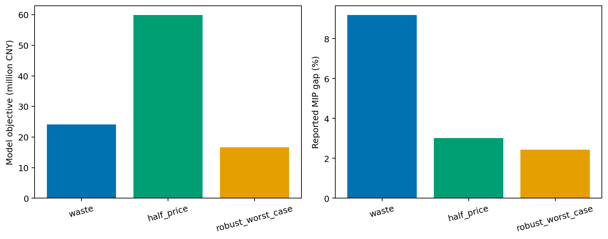
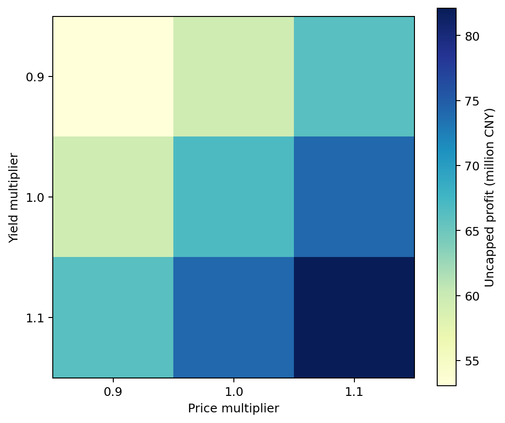

# 2024C 农作物的种植策略

## 摘要

本文读取官方附件中的54个地块、41种作物、87条2023种植记录和107条产量成本价格记录，总面积约1213亩。

建立2024—2030完整地块二元种植模型，表达地类—作物适种、容量、水浇地稻菜互斥、禁止连作和任意三年豆类约束。销量使用连续变量，比较滞销浪费、超额半价和区间保守端点三种情景。

朴素重复2023基线存在大量连作与豆类窗口违反；三个MILP输出均通过全部约束审计。求解器在限时内未全部证明最优，本文逐项报告MIP gap，不将可行解表述为全局最优。

- 关键词：种植规划
- 混合整数规划
- 轮作
- 情景分析
- 鲁棒优化

## 1 问题重述与规划范围

题目要求制定2024—2030种植方案，在不同滞销处理下提高收益，并考虑销量、亩产、成本和价格的不确定性及潜在相关性。

地类季次不同：旱地、梯田和山坡地一年一季；水浇地可种单季水稻或两季蔬菜；普通大棚第一季蔬菜、第二季食用菌；智慧大棚两季蔬菜。

所有地块禁止连续种同一作物，且每块地任意连续三年内至少种一次豆类。本文把规则转为可审计线性约束。

## 2 数据来源与完整性核验

附件1提供地块和作物基础表，附件2提供2023种植和统计参数。合并单元格造成的空白地块名向下填充，最终87条记录均可与地块表关联。

销量基准按2023每条种植面积乘对应地类—季次亩产量汇总。智慧大棚第一季参数依据附件2明确注释映射到普通大棚第一季，未人工猜测。

销售价格区间解析为低值、高值和中点。常规情景使用中点，鲁棒情景使用区间低端并叠加题面给出的年度变化保守端。

| 对象 | 核验值 |
|---|---|
| 地块 | 54 |
| 作物 | 41 |
| 2023种植记录 | 87 |
| 统计参数记录 | 107 |
| 销量映射失败 | 0 |

## 3 决策口径与模型边界

为严格表达逐地块轮作，v1规定每个地块每个活跃季次只选择一种作物，面积等于整块面积。原题允许分区混种，因此本模型可行域是原题可行域的保守子集。

这一简化使二元决策与历史作物、相邻季次和三年窗口直接对应，避免用极小面积虚假满足豆类约束。

因此目标值只能比较本仓库三个模型，不能声称是允许任意分块时的原题全局最优。下一版可将地块离散为统一小区并追踪小区级轮作。

## 4 符号、目标与销量变量

令x(p,y,s,c)为地块p在年份y、季次s种作物c的0—1变量；产量是面积、亩产和x的乘积。令sold(c,y)为按原价销售量。

sold不超过当年总产量与情景销量上限。超额浪费情景中只有sold产生收入；半价情景中全部产量先按半价计价，sold部分再补足另一半价格。

目标最大化七年收入减种植成本。求解接口使用最小化形式，故对利润取负。

| 符号 | 含义 |
|---|---|
| x(p,y,s,c) | 完整地块作物选择二元变量 |
| A(p) | 地块面积/亩 |
| q(c,l,s) | 亩产/斤每亩 |
| k(c,l,s) | 成本/元每亩 |
| sold(c,y) | 原价销量/斤 |

## 5 地类、季次和模式约束

旱地、梯田、山坡地每年单季从1—15号粮食中选一种。水浇地第一季选水稻或普通蔬菜，若选水稻则第二季关闭，否则第二季在35—37号三种蔬菜中选一种。

普通大棚第一季选17—34号蔬菜、第二季选38—41号食用菌；智慧大棚两季均选17—34号蔬菜。

候选裁剪保留每类季次单位面积基础利润前6种以及全部可种豆类，水浇地额外保留水稻。这提高限时求解稳定性，但进一步缩小可行域，元数据中明确记录。

## 6 轮作与豆类硬约束

2024选择不能与同地块2023同季已种作物重复；相邻年份同一作物不能重复。双季地块同一年两个季次也不能种同一作物。

对每块地和2024—2026、2025—2027直至2028—2030五个窗口，窗口内豆类作物选择数至少为1。

完整地块二元口径使“至少一次”具有明确面积含义。审计器独立从输出CSV重新检查容量、连作、豆类窗口和适种性，不只相信求解器状态。

## 7 简单基线：重复2023方案

把2023种植安排逐年复制到2024—2030，构成无需优化的朴素基线。它直观且可复算，但预期会违反连续种植和豆类轮作。

独立审计得到连续种植违反196次、豆类三年窗口违反175次。因此它只用于说明约束必要性，不能作为推荐计划。

适种性审计对基线也可能报告违反，因为历史表允许同一地块分区多作，而v1完整地块模型的季次映射更严格；这再次说明基线和优化模型口径必须区分。

## 8 情景一：超额产量浪费

销量上限取2023估计销量；超过上限的产量不产生收入，但仍产生种植成本。该情景惩罚盲目集中到高亩产、高价格但需求有限的作物。

模型使用作物—年份销量变量把不同地类生产汇总。由于不同地类价格可能不同，销量收入采用该作物适用记录的价格中位数，这是显式近似。

输出包括完整计划、目标值、求解状态、运行时间、变量/约束数、MIP gap和四项独立审计。

## 9 情景二：超额产量半价销售

全部产量至少按50%价格计入收入，销量上限内部分再增加50%价格。相较浪费情景，高产作物的边际价值提高。

该情景并不假设现实市场一定能无限吸收半价农产品；它严格对应题目给定的替代处理规则，用于比较计划结构对剩余产品处置的敏感度。

模型结构与硬约束保持不变，只有目标收入系数变化，因此计划差异可归因于滞销处理而非约束口径变化。

## 10 保守鲁棒系数情景

小麦和玉米销量按题面5%—10%年增长区间取5%；其他作物按±5%取低端。亩产按±10%取0.9，成本按约5%年增长累乘。

价格取官方区间低端；食用菌价格再按年下降的保守端处理。该做法是确定性最坏端点近似，而不是已证明覆盖全部相关不确定集的严格两阶段鲁棒优化。

其价值在于给出同一约束下的压力测试。完整鲁棒模型还需建立需求、亩产、成本和价格的联合不确定集及可调决策。

## 11 三模型结果与最优性缺口

三个模型均在限时内返回整数可行解并通过容量、连作、豆类窗口和适种性审计。求解器success为false表示达到时限而非无可行解。

MIP gap是当前可行解与求解器界之间的相对差距。只有gap接近0并且求解状态证明最优，才能使用“全局最优”表述。

半价情景目标值显著高于浪费情景符合收入口径；不同情景目标值的绝对值还受价格聚合和完整地块假设影响。

| 模型 | 目标利润/百万元 | MIP gap | 运行/s |
|---|---|---|---|
| waste | 24.185 | 9.18% | 10.08 |
| half_price | 59.881 | 3.01% | 10.14 |
| robust_worst_case | 16.684 | 2.44% | 10.14 |

## 12 误差与约束审计

数据审计确认销量计算没有未匹配的历史种植记录。求解后按CSV重算每块地每季面积、相邻年份同作物、任意三年豆类以及地类季次允许作物。

三种优化计划四项违反数均为0。审计通过只证明计划满足当前编码约束，不证明约束完全覆盖题意，也不证明经济参数准确。

计划发布时必须连同scenario、candidate_limit、MIP gap和完整地块假设一起提供，避免CSV脱离元数据被误用。

## 13 价格—产量敏感性

固定各情景计划，对价格和亩产分别施加0.9、1.0、1.1倍扰动，计算不考虑销量上限的收入—成本变化。该表用于比较方向，不替代情景目标。

价格和亩产对收入呈乘法影响，二者同时下行时利润下降最快。计划间差异反映作物组合和地类分布。

下一步应在销量上限内重算利润，并用相关采样生成收益分布、下行风险和条件风险价值，而不是只报告均值。

## 14 结果解释、局限与改进

优点是全字段来自官方附件、智慧大棚映射有官方注释依据、规则转为显式线性约束，并把朴素基线失败与优化可行性放在同一审计框架。

局限包括完整地块单作、候选裁剪、作物价格中位数聚合、未建小区级轮作、未显式表示作物替代/互补相关性，以及限时解存在MIP gap。

改进顺序应为：地块小区化与附件模板导出；滚动需求和相关不确定集；暖启动和更长求解；多目标风险收益；最终人工检查农村生产可操作性。

## 15 结论与复现说明

本文交付官方附件解析、销量字典、朴素基线、两种滞销MILP、保守鲁棒模型、三套计划、约束审计和敏感性分析。

复现命令为cumcm-lens run-2024c。每个情景在独立进程中运行，避免求解器原生内存相互影响；元数据保存时间、变量、约束和gap。

这些结果适合建模训练和方案比较，不是农业经营建议。实施前必须结合当地政策、市场合同、气候、人工和实际可分区能力复核。

- 数据字典：data/dictionaries/2024C.md
- Notebook：notebooks/2024C_crop_planning.ipynb
- 情景计划：data/processed/2024C/
- 模型实现：src/cumcm_lens/cases/crop_planning.py
